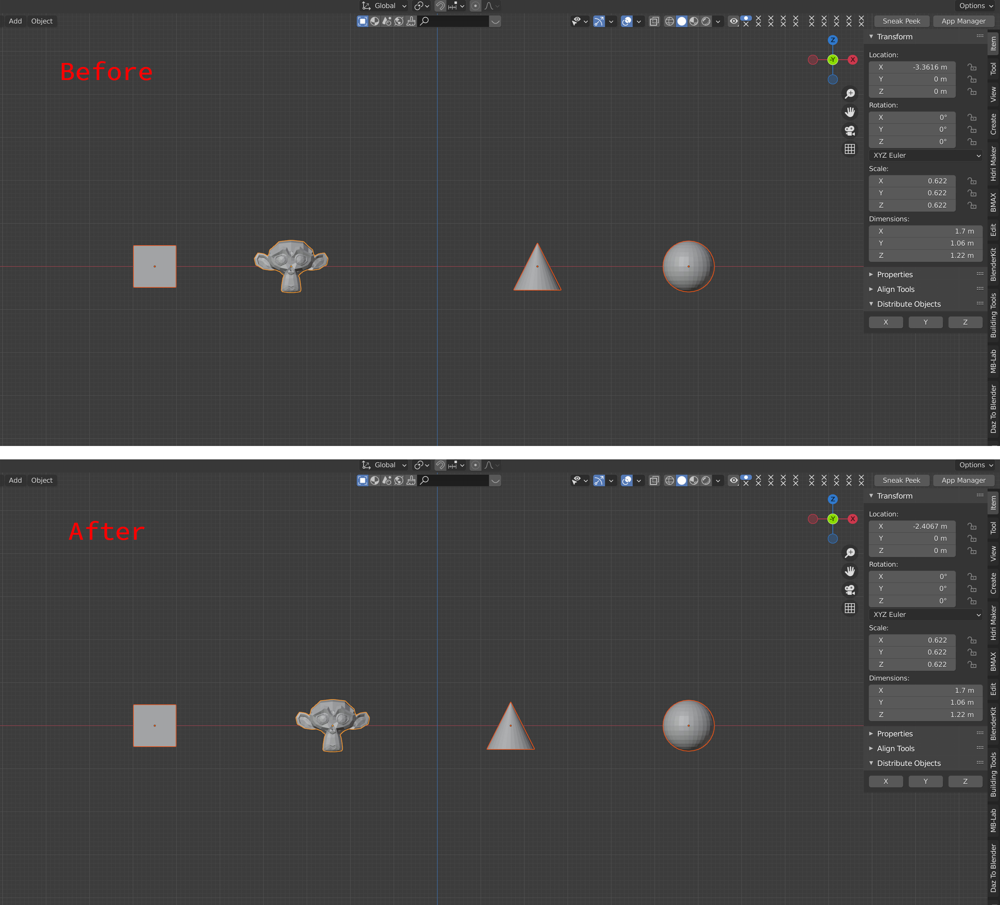

# Simple Distribute Objects for Blender

A Blender add-on that spaces selected objects evenly along the X, Y, or Z axis. It uses each object's location to determine the order and spacing, and keeps the first and last objects in place.

## What it does

Select three or more objects in Object Mode, then choose an axis. The add-on sorts the selection by location on that axis and moves the objects between the two endpoints to equal intervals. Locations on the other two axes are preserved.

Spacing is based on **object locations (origins)**, not the visible edges or bounding boxes of the objects. This tool does not create copies or scatter objects across a surface.

## Install

1. Download the repository as a ZIP file from GitHub.
2. In Blender, open **Edit → Preferences → Add-ons → Install…** and select the ZIP file.
3. Enable **Object: Simple Distribute Objects**. You can search for “distribute” in the Add-ons list.

The add-on declares Blender 2.80 as its minimum version. Compatibility with newer Blender versions has not been documented as tested.

## Use

1. In Object Mode, select at least three objects.
2. In the 3D Viewport, press **N** to open the sidebar.
3. Open the **Item** tab and expand **Distribute Objects**.
4. Click **X**, **Y**, or **Z** to distribute the selected objects along that axis.

The two objects at the minimum and maximum locations on the chosen axis remain at their current positions. If several objects share the same location on that axis, their relative order is not specified here.

## Source files

- `__init__.py` — add-on metadata and registration
- `distribute_pnl.py` — sidebar panel
- `distribute_op.py` — X, Y, and Z distribution operators
- `preview.jpg` — panel preview

## Credits and license

The add-on metadata credits **Allen Chia** as the author. This repository is licensed under the GNU General Public License v3.0; see [LICENSE](LICENSE).
